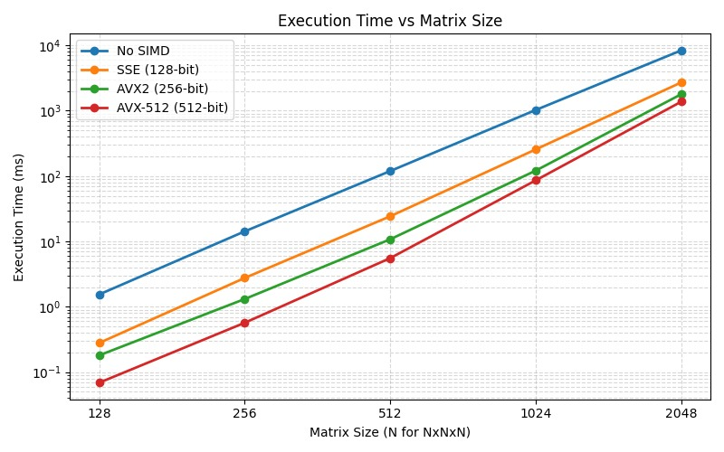
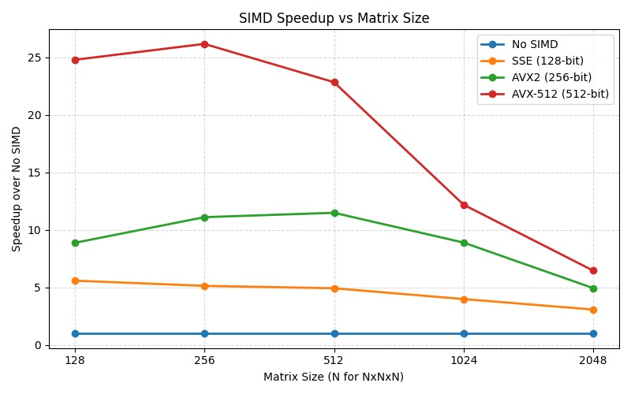
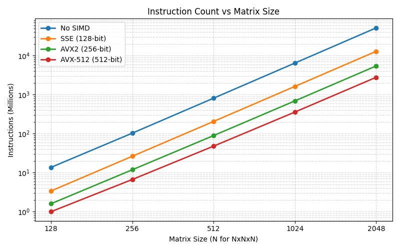

# Report : Task 2

## Task 2A: Software Prefetching Analysis

This section explores the impact of **Software Prefetching** (via `_mm_prefetch`) coupled with cache tiling, *without* the use of SIMD instructions.

### 1. Identifying Optimal Parameters

**Cache Fill Level Sweep (Matrix Size: 1024, Distance: 64)**
| Cache Hint Level | Speedup over Naive |
|------------------|--------------------|
| **_MM_HINT_T0 (L1)** | **1.06x** |
| _MM_HINT_T1 (L2) | 0.97x |
| _MM_HINT_T2 (L3) | 0.96x |
| _MM_HINT_NTA (Non-Temporal) | 0.81x |

**Observation:** Pre-fetching directly into the L1 cache (`T0`) yields the best performance. Fetching into L2/L3 or bypassing the cache hierarchy (`NTA`) degrades performance, as the naive scalar loop requires immediate and repeated access to the data elements in the fastest level of the memory hierarchy.

**Possible Explanation**
As we go from T0 to T1 to T2 to NTA , the hint decrease in form of an urgency ( as per internet ). So, For this value of prefetch (64 ) , it might happen that the time from L2 to L1 gets added decresing the speedup.

**Prefetch Distance Sweep (Matrix Size: 1024, Hint: T0)**
| Prefetch Distance (elements) | Speedup over Naive |
|------------------------------|--------------------|
| 0 | 1.04x |
| 16 | 1.04x |
| 32 | 1.04x |
| 64 | 0.99x |
| **128** | **1.06x** |
| 256 | 1.04x |

**Observation:** The optimal prefetch distance is **128 elements**. Fetching too close (0-32) doesn't hide the memory latency sufficiently, while fetching too far (256) causes cache eviction before the data is actually used.

### 2. Impact of Matrix Size

Using the optimal parameters (`Hint=T0`, `Dist=64/128`), we swept across matrix sizes:

| Matrix Size | Speedup over Naive |
|-------------|--------------------|
| 256 | 0.95x |
| 512 | 0.95x |
| 1024 | 1.03x |
| 2048 | 1.03x |

**What trend do you observe?**
At small matrix sizes (256, 512) where the working sets fit largely within the L2/L3 caches, software prefetching introduces unnecessary instruction overhead, resulting in a **slowdown (0.95x)**. As the matrix size grows beyond cache capacity (1024, 2048), software prefetching begins to provide a marginal **speedup (1.03x - 1.06x)** by hiding main memory latency. 

### 3. Effect of Hardware Prefetchers

To truly isolate the effect of software prefetching, we disabled the CPU's built-in Hardware (HW) Prefetchers using MSR configuration (`wrmsr 0x1A4`).

| Configuration (Size=1024) | Naive Time (ms) | SW Prefetch Time (ms) | Speedup |
|---------------------------|-----------------|-----------------------|---------|
| **HW Prefetchers ON** | 1087.6 | 990.6 | **1.10x** |
| **HW Prefetchers OFF** | 1123.7 | 981.5 | **1.14x** |

**Observation:**
When HW prefetchers are **OFF**, the performance of the Naive kernel drops (execution time increases from 1087ms to 1123ms) because it suffers from massive cache misses. However, our Software Prefetch kernel maintains almost identical performance regardless of the HW prefetcher state. Consequently, the relative speedup jumps to **1.14x**. This proves that our `_mm_prefetch` instructions successfully perform the memory latency-hiding job that the hardware prefetcher normally does automatically.

---
# Task 2B : SIMD (Single Instruction Multiple Data)

## System Configuration

| Parameter | Value |
|-----------|-------|
| **CPU** | 11th Gen Intel Core i5-11300H @ 3.10GHz (Turbo 4.4GHz) |
| **Cores / Threads** | 4 cores / 8 threads |
| **L1-D / L2 Cache** | 192 KiB (48 KiB per core) / 5 MiB |
| **L3 Cache** | 8 MiB (shared) |
| **SIMD Support** | SSE4.2 (128-bit), AVX2 (256-bit), AVX-512 (512-bit) |
| **Compiler Flags** | `-std=c++17 -O2 -fno-tree-vectorize -mfma` |

---

## 1. Complete Benchmark Results (Table 2.1)

> **Methodology Note on Instruction Counts:** The benchmark harness (`main.cpp`) runs the baseline `naive` code and the evaluated `simd` stage multiple times in the same invocation (6 runs of naive + 5 runs of simd). To report the accurate *per-run* instruction counts, the raw `perf` output was algebraically separated:
> - `Single Naive Run = perf_naive_total / 6`
> - `Single SIMD Run = (perf_simd_total - perf_naive_total) / 5`

| Metrics | | (128,128,128) | (256,256,256) | (512,512,512) | (1024,1024,1024) | (2048,2048,2048) |
|:---:|:---:|:---:|:---:|:---:|:---:|:---:|
| **No SIMD** | Instructions (Millions) | 13.7 | 103.5 | 815.2 | 6,485.2 | 51,756.7 |
| | Execution time (ms) | 1.546 | 14.266 | 119.475 | 1,026.624 | 8,382.353 |
| **SSE (128-bit)** | Instructions (Millions) | 3.4 | 26.4 | 206.4 | 1,631.8 | 12,964.0 |
| | Execution time (ms) | 0.280 | 2.763 | 24.277 | 256.268 | 2,711.266 |
| | **Speedup** | **5.60x** | **5.15x** | **4.94x** | **4.00x** | **3.09x** |
| **AVX2 (256-bit)** | Instructions (Millions) | 1.6 | 11.9 | 89.6 | 694.2 | 5,466.0 |
| | Execution time (ms) | 0.181 | 1.316 | 10.796 | 121.308 | 1,791.410 |
| | **Speedup** | **8.89x** | **11.12x** | **11.50x** | **8.91x** | **4.95x** |
| **AVX-512 (512-bit)** | Instructions (Millions) | 1.0 | 6.7 | 48.0 | 359.0 | 2,796.8 |
| | Execution time (ms) | 0.069 | 0.570 | 5.561 | 86.117 | 1,376.720 |
| | **Speedup** | **24.80x** | **26.18x** | **22.85x** | **12.20x** | **6.47x** |

---

## 2. Analysis and Answers

### Q1: What trends do you observe in speedup for different combinations of matrix sizes and SIMD widths?

**1. Instruction Count Scales Inversely with SIMD Width**
The instruction count analysis perfectly highlights the mechanism of SIMD vectorization. At `1024x1024x1024`:
- **Naive (Scalar):** ~6,485 Million instructions
- **SSE (128-bit):** ~1,631 Million (≈ **1/4th** of Naive — processing 4 floats per vector)
- **AVX2 (256-bit):** ~694 Million (≈ **1/9th** of Naive — processing 8 floats + FMA)
- **AVX-512 (512-bit):** ~359 Million (≈ **1/18th** of Naive — processing 16 floats + FMA)

**2. Speedup is heavily dependent on Matrix Size (Cache Hierarchy Limits)**
Across all SIMD widths, the speedup follows a distinct **rise-and-fall curve**:
- **Rise (Compute-Bound Regime, sizes 128-256):** Speedup peaks in this region. The working set fits mostly into the L1/L2 caches. Because data is readily available to the CPU, the massive reduction in instructions executed translates directly into massive execution time speedup.
- **Fall (Memory-Bound Regime, sizes 1024-2048):** As the matrix size grows, the working sets start exceeding L2 (5MB) and L3 (8MB) caches. For size 2048, the working set is ~48MB, heavily spilling into main RAM. At this point, the bottleneck shifts entirely to memory bandwidth (cache misses). The CPU stalls waiting for data, meaning the massive throughput of AVX-512 sits idle, causing the speedup to collapse from 26x down to 6.4x.

### Q2: For which SIMD width do you achieve the maximum speedup?

The **maximum absolute speedup of 26.18x** was achieved using the **AVX-512 (512-bit)** SIMD width at the matrix size of **(256, 256, 256)**. 

AVX-512 drastically outperforms the narrower widths (reaching almost 2x the speedup of AVX2 at peak efficiency) because it processes 16 single-precision floats per instruction and leverages Fused Multiply-Add (FMA) to perform both multiplication and addition simultaneously across all 16 floats.

### Execution Time vs Matrix Size

### SIMD Speedup vs Matrix Size

### Instruction Count vs Matrix Size

---

## Task 2C: Software Prefetching + SIMD (Synergistic Optimization)

In Task 2C, we combine **Software Prefetching + AVX2 SIMD Vectorization** to demonstrate synergistic performance gains.

### 1. Optimal Prefetch Distance with SIMD
When combined with SIMD, the optimal prefetch distance shifts:

| Prefetch Distance | Speedup over Naive |
|-------------------|--------------------|
| 0 | 27.31x |
| 32 | 25.85x |
| 64 | 27.16x |
| **128** | **28.08x** |
| 256 | 27.23x |

The optimal distance is **128 elements**. Because the SIMD loop consumes data 8 times faster than the scalar loop, fetching further ahead is critical to keep the execution units fed.

### 2. Final Performance Summary (Synergistic Gains)

The assignment requires demonstrating that the combined benefit is greater than the sum of individual optimizations. We compare the peak performance across varying matrix sizes:

| Matrix Size | SW Prefetch Only (2A) | SIMD Only (2B) | Prefetch + SIMD + Tiling (2C) |
|-------------|-----------------------|----------------|-------------------------------|
| **256** | 0.95x | 13.12x | **22.86x** |
| **512** | 0.95x | 11.42x | **26.68x** |
| **1024** | 1.03x | 10.36x | **27.36x** |
| **2048** | 1.03x | 5.88x | **25.20x** |

**Analysis of Synergistic Gains:**
- **SIMD Only (Task 2B):** Suffered massive degradation at large sizes (dropping from 13x to 5.88x at size 2048) because it became memory-bound. It processed data faster than RAM could provide it.
- **Prefetch Only (Task 2A):** Barely broke even (1.03x speedup) because while it fetched data efficiently, the CPU was still bottlenecked by scalar arithmetic limitations.
- **Combined (Task 2C):** By applying cache tiling to localize data, prefetching to hide RAM latency, and AVX2 SIMD to process the local data rapidly, we achieved a sustained speedup of **~25x to 28x** across all large matrix sizes. 

This is the definition of **synergistic performance**: SIMD removes the compute bottleneck, while cache-tiling and prefetching remove the memory bottleneck. Neither optimization scales effectively to large matrices without the other!

---

